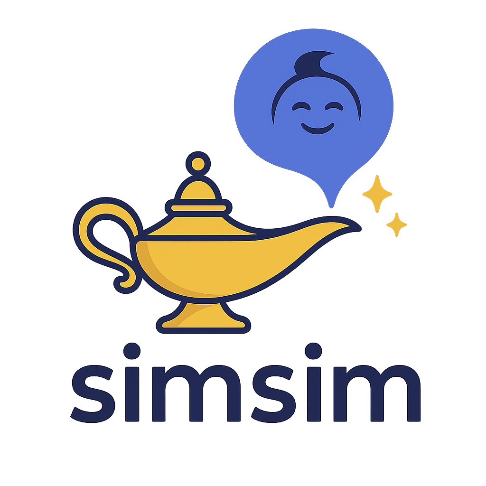
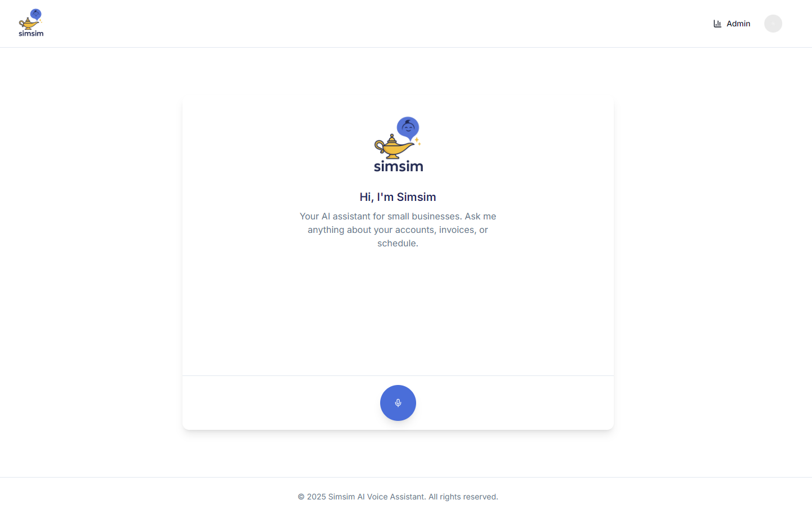

#  Simsim – Real-Time AI Voice Assistant

**Simsim** is a real-time AI voice assistant built for the browser using:
- 🎤 [Deepgram](https://deepgram.com) for speech-to-text (STT)
- 🧠 [OpenAI GPT-3.5](https://platform.openai.com/) for language understanding
- 🔊 [ElevenLabs](https://elevenlabs.io) for text-to-speech (TTS)
- ⚛️ [Next.js](https://nextjs.org/) for full-stack web framework

It enables users to speak directly into the browser, ask questions, and get spoken AI-powered answers instantly — simulating a human-like customer service experience.

## 📸 Preview

<div align="center">
  
</div>

---

## 📦 Features

- 🎙️ Record and transcribe voice in real time using Deepgram
- 🤖 Get AI responses using OpenAI's GPT-3.5
- 🗣️ Convert responses into human-like speech using ElevenLabs
- 🌐 Runs fully in-browser with no phone infrastructure required
- 🔧 Built in modular fashion for easy extension (e.g., Retell AI support)

---

## 🚀 Getting Started

### 1. Clone the Repository

```bash
git clone https://github.com/your-username/simsim.git
cd simsim
```

### 2. Install Dependencies

```bash
npm install
```

### 3. Add Environment Variables

Create a `.env.local` file:

```env
NEXT_PUBLIC_DEEPGRAM_API_KEY=your_deepgram_api_key
OPENAI_API_KEY=your_openai_api_key
ELEVENLABS_API_KEY=your_elevenlabs_api_key
```

> 🔐 Keep your API keys secret — never commit them to version control.

### 4. Run the Dev Server

```bash
npm run dev
```

Then visit: [http://localhost:3000](http://localhost:3000)

---

## 🧠 Architecture

```
🎤 Your Voice
  ↓
[Deepgram] → Transcription
  ↓
[OpenAI GPT-3.5] → AI Response
  ↓
[ElevenLabs] → Speech Reply
  ↓
🔊 Played in browser
```
